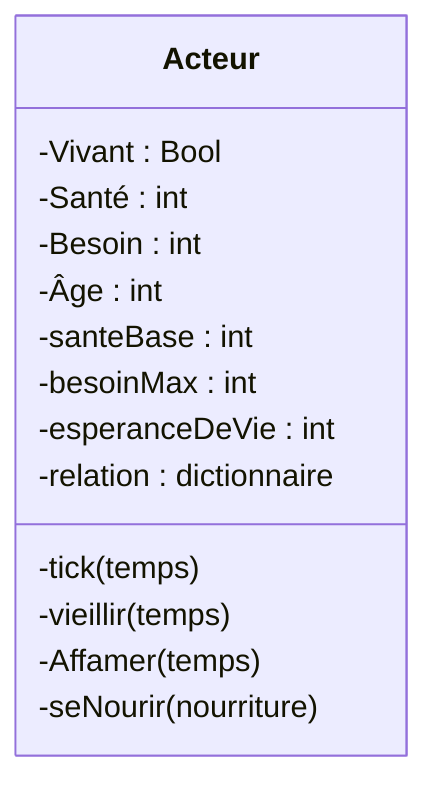

# Projet de simulation

## Contexte

Impressionné par les jeux/alogrithmes qui simulent des comportements dans lesquels on peut faire varier des paramètres, j'ai décidé de construtrir mon propre algorithme pourre observer l'évolution de ce que j'aurais créer et faire en sorte qu'elle arrive à gérer différentes contraintes. La finalité serait d'arriver à faire un tri génétique, c'est à dire de séléctionner les individus les plus aptes à survivre/à accomplir les objectifs donnés et répéter ce processus afin de finir avec des goat

## Déroulement

### 1) Configuration générale
Des acteurs "vivrons" dans un certains contexte avec des ressources à disposition et des besoins, le monde avancera à chaque tick

### 2) Définition de l'acteur

